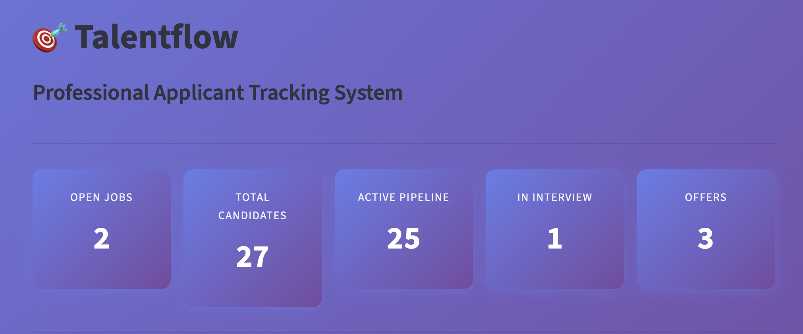

# 🎯 TalentFlow - AI-Powered Applicant Tracking System  

 

*A professional recruitment management system powered by AI for intelligent resume parsing and candidate matching.*

## 📋 Overview

**TalentFlow** is a comprehensive Applicant Tracking System (ATS) that leverages artificial intelligence to streamline the recruitment process.  
From automated resume parsing to intelligent candidate matching, interview scorecards, and offer letter generation — TalentFlow handles the entire hiring pipeline.
 
### 🎯 Key Highlights

- **AI-Powered Resume Parsing:** Automatic extraction of candidate information using GPT-4  
- **Intelligent Matching:** Score candidates based on job requirements and skills  
- **Visual Pipeline:** Kanban-style recruitment pipeline management  
- **Interview Management:** Built-in scorecard system for structured interviews  
- **Analytics Dashboard:** Real-time insights into recruitment metrics  
- **Offer Generation:** Professional offer letter creation with DOCX export  

---

## ✨ Features

### 🤖 AI-Powered Features

- **Smart Resume Parsing:** Extract name, email, phone, skills, experience, and more  
- **Skill Matching:** Intelligent matching algorithm with configurable thresholds  
- **Duplicate Detection:** Automatic identification of duplicate applications  
- **GPT-4 Integration:** Optional AI analysis for enhanced accuracy  

### 📊 Recruitment Management

- **Job Posting Management:** Create and manage job openings with detailed requirements  
- **Candidate Pipeline:** Track candidates through 5 stages (Received → Screening → Interview → Offer → Hired)  
- **Bulk Upload:** Process multiple resumes simultaneously  
- **Manual Entry:** Add candidates manually when needed  

### 🎯 Interview & Evaluation

- **Structured Scorecards:** Evaluate candidates on technical, communication, cultural fit, and problem-solving skills  
- **Multi-evaluator Support:** Multiple team members can provide feedback  
- **Quick Actions:** Sidebar shortcuts for rapid scorecard entry  
- **Historical Tracking:** View all past evaluations for each candidate  

### 📈 Analytics & Insights

- **Real-time Metrics:** Dashboard with key recruitment KPIs  
- **Conversion Funnel:** Visualize drop-off rates at each stage  
- **Skills Analysis:** Identify most common skills in candidate pool  
- **Source Tracking:** Measure effectiveness of recruitment channels  
- **Timeline Analysis:** Track application trends over time  

### 📄 Offer Management

- **Professional Templates:** Generate formatted offer letters  
- **Customizable Details:** Salary, benefits, start date, and more  
- **DOCX Export:** Download ready-to-send documents  
- **Bulk Generation:** Create multiple offers efficiently  

---

## 🎬 Demo

- **Dashboard Overview**  
    
- **Candidate Pipeline**  
    
- **Analytics**  
    

---

## 🎓 Skills Demonstrated

- **Data Science & AI**
    Natural Language Processing (NLP)
    Machine Learning integration
    Feature extraction and matching algorithms
    Statistical analysis and visualization

- **Software Engineering**
    Full-stack development
    Database design and optimization
    API integration
    Error handling and validation
    
- **Product Development**
    UX design
    Business logic implementation
    Requirement analysis
    Agile development
    
- **Technical Skills**
    Python programming
    SQL database management
    REST API consumption
    Git version control
    Documentation